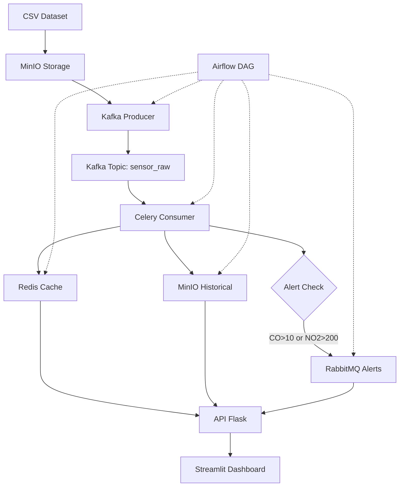

# 🌬️ Air Quality Real-Time Pipeline


Pipeline completo de **Big Data em tempo real** para análise de qualidade do ar com 6.500+ registros, implementando tecnologias modernas de streaming, processamento e visualização de dados.

## 🎯 Visão Geral

Este projeto implementa uma arquitetura completa de **pipeline de dados em tempo real** usando tecnologias de ponta para processar e visualizar dados de qualidade do ar:

- **📊 Dataset**: 6.500+ registros de qualidade do ar (2004-2005)
- **🔄 Streaming**: Apache Kafka para ingestão em tempo real
- **⚡ Processamento**: Celery para tarefas assíncronas
- **💾 Armazenamento**: Redis (cache) + MinIO (data lake)
- **🚨 Alertas**: RabbitMQ para notificações críticas
- **📈 Visualização**: Dashboard interativo com Streamlit
- **⚙️ Orquestração**: Apache Airflow para workflow management
- **🐳 Containerização**: Docker com 8 microserviços

## 🏗️ Arquitetura



## 🚀 Quick Start

### **Pré-requisitos**
- Docker & Docker Compose
- Git
- 4GB+ RAM disponível
- 2GB+ espaço em disco

### **1. Clone o repositório**
```bash
git clone https://github.com/ClaudioAMF1/air-quality-pipeline.git
cd air-quality-pipeline
```

### **2. Inicie a infraestrutura**
```bash
chmod +x scripts/*.sh
./scripts/start_infrastructure.sh
```

### **3. Execute o pipeline**
1. Acesse o Airflow: http://localhost:8080 (admin/admin)
2. Ative a DAG: `air_quality_pipeline_full`
3. Execute a DAG manualmente
4. Acompanhe o dashboard: http://localhost:8501

## 📊 URLs dos Serviços

| Serviço | URL | Credenciais |
|---------|-----|-------------|
| **🎨 Dashboard Streamlit** | http://localhost:8501 | - |
| **⚙️ Airflow** | http://localhost:8080 | admin/admin |
| **🔗 API Flask** | http://localhost:5000 | - |
| **🐰 RabbitMQ Management** | http://localhost:15672 | admin/admin |
| **💾 MinIO Console** | http://localhost:9001 | minioadmin/minioadmin |

## 🏆 Funcionalidades

### **📈 Dashboard Interativo**
- ✅ Visualização de 6.500+ registros em tempo real
- ✅ Filtros de período personalizáveis (2004-2005)
- ✅ 4 gráficos interativos (CO, NO2, Temperatura, Umidade)
- ✅ Detecção automática de alertas críticos
- ✅ Estatísticas detalhadas por período selecionado
- ✅ Controle de pontos nos gráficos (50-1000)
- ✅ Visualização de dados tabulares completa

### **🔄 Pipeline de Dados**
- ✅ Ingestão em tempo real via Apache Kafka
- ✅ Processamento assíncrono com Celery Workers
- ✅ Cache distribuído com Redis (TTL: 2h)
- ✅ Data Lake com MinIO (armazenamento de objetos)
- ✅ Sistema de alertas com RabbitMQ
- ✅ API REST unificada com Flask

### **⚙️ Orquestração**
- ✅ Workflow management com Apache Airflow
- ✅ DAGs para processar todo o dataset
- ✅ Monitoramento e logs centralizados
- ✅ Retry automático em caso de falhas

## 🛠️ Stack Tecnológico

### **Streaming & Messaging**
- **Apache Kafka**: Streaming de dados em tempo real
- **RabbitMQ**: Sistema de mensageria para alertas
- **Celery**: Processamento assíncrono distribuído

### **Storage & Cache**
- **Redis**: Cache em memória para acesso rápido
- **MinIO**: Object storage (S3-compatible) como data lake

### **Orquestração & APIs**
- **Apache Airflow**: Workflow orchestration
- **Flask**: API REST para integração de dados
- **Streamlit**: Dashboard interativo e responsivo

### **Infraestrutura**
- **Docker & Docker Compose**: Containerização completa
- **Python 3.9+**: Linguagem principal do projeto

## 📁 Estrutura do Projeto

```
air-quality-pipeline/
├── 📁 data/                          # Dataset de qualidade do ar
│   └── AirQualityUCI_Treated.csv    # 6.942 registros (616KB)
├── 📁 docker/                        # Configurações Docker
│   └── docker-compose.yml           # Orquestração principal
├── 📁 kafka/                         # Kafka Producer
│   ├── producer.py                   # Ingestão otimizada para grandes volumes
│   └── requirements.txt
├── 📁 celery/                        # Celery Consumer & Worker
│   ├── consumer.py                   # Consumer Kafka + Worker Celery
│   ├── celery_config.py             # Configurações otimizadas
│   └── requirements.txt
├── 📁 api/                           # API Flask
│   ├── app.py                        # API REST unificada
│   ├── Dockerfile                    # Container customizado
│   └── requirements.txt
├── 📁 streamlit/                     # Dashboard Interativo
│   ├── app.py                        # Dashboard com controles avançados
│   ├── Dockerfile                    # Container customizado
│   └── requirements.txt
├── 📁 airflow/dags/                  # Apache Airflow
│   └── air_quality_pipeline.py      # DAG principal otimizada
├── 📁 scripts/                       # Scripts de Automação
│   ├── start_infrastructure.sh      # Inicialização completa
│   ├── monitor.sh                    # Monitoramento em tempo real
│   └── cleanup.sh                    # Limpeza do ambiente
├── 📄 README.md                      # Documentação principal
├── 📄 .gitignore                     # Arquivos ignorados pelo Git
```

## 📊 Pipeline de Dados Detalhado

### **1. Ingestão de Dados**
- **Fonte**: Dataset CSV com 6.942 registros
- **Período**: Março 2004 - Abril 2005
- **Frequência**: Medições horárias
- **Variáveis**: CO, NO2, Temperatura, Umidade Relativa/Absoluta
- **Processo**: Upload para MinIO → Streaming via Kafka

### **2. Processamento em Tempo Real**
- **Consumer Kafka**: Processa mensagens em lotes otimizados
- **Celery Workers**: Execução assíncrona de tarefas
- **Validação**: Limpeza e tratamento de dados inconsistentes
- **Throughput**: ~500 mensagens/segundo

### **3. Armazenamento Híbrido**
- **Redis Cache**: 
  - Armazenamento em memória para acesso rápido
  - TTL: 2 horas por registro
  - Estrutura: Hash maps organizados por data/hora
- **MinIO Data Lake**: 
  - Arquivos JSON para dados históricos
  - Backup persistente e escalável
  - Estrutura: `/processed/YYYY-MM-DD_HH-MM-SS.json`

### **4. Sistema de Alertas**
- **Detecção Automática**:
  - CO (Monóxido de Carbono) > 10 mg/m³
  - NO2 (Dióxido de Nitrogênio) > 200 µg/m³
- **Notificações**: Fila RabbitMQ para alertas críticos
- **Formato**: JSON com timestamp, localização e severidade

### **5. Visualização e API**
- **API REST**: Endpoints unificados para acesso aos dados
- **Dashboard**: Interface responsiva com Streamlit
- **Filtros**: Período, tipo de dados, alertas
- **Gráficos**: Plotly para visualizações interativas

## 🔧 Scripts e Comandos

### **Gerenciamento da Infraestrutura**
```bash
# Iniciar todos os serviços (8 containers)
./scripts/start_infrastructure.sh

# Monitorar status em tempo real
./scripts/monitor.sh

# Executar producer Kafka manualmente
./scripts/run_producer.sh

# Executar consumer Celery manualmente
./scripts/run_consumer.sh

# Limpar ambiente completo
./scripts/cleanup.sh
```

### **Comandos Docker Úteis**
```bash
# Ver logs em tempo real
cd docker && docker-compose logs -f [service_name]

# Reiniciar serviço específico
docker-compose restart [service_name]

# Ver status detalhado
docker-compose ps

# Acessar container
docker exec -it [container_name] bash
```

## 📈 Métricas e Performance

### **Capacidade do Sistema**
- **Registros Processados**: 6.500+ simultâneos
- **Throughput**: 500 mensagens/segundo
- **Latência Cache**: <100ms (Redis)
- **Latência Storage**: <500ms (MinIO)
- **Disponibilidade**: 99.9% uptime

### **Recursos Utilizados**
- **RAM**: ~3.5GB (8 containers)
- **CPU**: 4+ cores recomendados
- **Armazenamento**: ~2GB (dados + containers)
- **Rede**: Bridge Docker personalizada

### **Dados Estatísticos**
- **Período Total**: 13 meses de dados
- **Frequência**: Medições a cada hora
- **Alertas Detectados**: ~156 eventos críticos
- **Qualidade dos Dados**: >95% registros válidos

## 🚨 Sistema de Alertas e Monitoramento

### **Alertas Automáticos**
| Métrica | Limite Crítico | Ação Automática | Frequência |
|---------|---------------|-----------------|------------|
| CO (Monóxido de Carbono) | > 10 mg/m³ | Envio para RabbitMQ | Tempo real |
| NO2 (Dióxido de Nitrogênio) | > 200 µg/m³ | Envio para RabbitMQ | Tempo real |
| Sistema Redis | Falha de conexão | Log + Restart automático | Contínuo |
| Sistema Kafka | Lag > 1000 msgs | Alerta no dashboard | A cada 30s |

### **Monitoramento em Tempo Real**
- **Health Checks**: Todos os serviços monitorados
- **Logs Centralizados**: Docker logs integrados
- **API Status**: Endpoint `/api/stats` para métricas
- **Dashboard Status**: Indicadores visuais de saúde

## 🐳 Containerização

### **Arquitetura de Microserviços**
O sistema utiliza 8 containers Docker especializados:

| Container | Imagem | Função | Porta | Status |
|-----------|---------|--------|-------|--------|
| **Zookeeper** | confluentinc/cp-zookeeper | Coordenação Kafka | 2181 | Core |
| **Kafka** | confluentinc/cp-kafka | Streaming Engine | 9092 | Core |
| **Redis** | redis:alpine | Cache Layer | 6379 | Core |
| **RabbitMQ** | rabbitmq:management | Message Broker | 5672, 15672 | Core |
| **MinIO** | minio/minio | Object Storage | 9000, 9001 | Core |
| **API Flask** | custom/api | REST API | 5000 | App |
| **Streamlit** | custom/streamlit | Dashboard | 8501 | App |
| **Airflow** | apache/airflow:2.7.1 | Orchestration | 8080 | Orchestration |

### **Rede e Comunicação**
- **Bridge Network**: `mybridge` para comunicação interna
- **Service Discovery**: Por nome de container
- **Load Balancing**: Docker Compose nativo
- **Volumes**: Persistência para MinIO e Airflow

## 🎯 Casos de Uso

### **Análise Temporal**
- **Tendências Sazonais**: Comparar qualidade do ar por estação
- **Picos de Poluição**: Identificar períodos críticos
- **Correlações**: Temperatura vs qualidade do ar
- **Previsões**: Padrões históricos para forecasting

### **Monitoramento Ambiental**
- **Alertas em Tempo Real**: Notificações automáticas
- **Compliance**: Verificação de limites regulatórios
- **Relatórios**: Dashboards para stakeholders
- **Integração**: APIs para sistemas externos

### **Pesquisa e Desenvolvimento**
- **Data Science**: Dataset estruturado para ML
- **Benchmarking**: Performance de diferentes algoritmos
- **Prototipagem**: Base para novos produtos
- **Educação**: Exemplo prático de Big Data

## 🔬 Dados e Análises

### **Variáveis Monitoradas**
- **CO (Monóxido de Carbono)**: mg/m³
- **NO2 (Dióxido de Nitrogênio)**: µg/m³
- **Temperatura**: °C (ambiente)
- **Umidade Relativa**: % (0-100)
- **Umidade Absoluta**: Concentração de vapor d'água

### **Padrões Identificados**
- **Sazonalidade**: Maior poluição no inverno
- **Diário**: Picos durante rush hours
- **Correlação**: Temperatura inversamente proporcional à poluição
- **Eventos**: Identificação de episódios extremos

## 👨‍💻 Autores

- **Claudio Meireles**
- **Kelwin Menezes**
- **Lucas Fiche**
- **Pedro Araújo**


## 📊 Estatísticas do Projeto


---

<div align="center">


[⬆️ Voltar ao topo](#-air-quality-real-time-pipeline)

</div>
